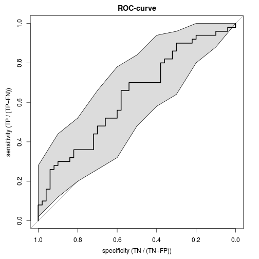

Association tests and measures for ordered categorical variables
=========================

TODO
-------------------------

 - link to correlation, association, diagCategorical

Install required packages
-------------------------

[`coin`](http://cran.r-project.org/package=coin), [`mvtnorm`](http://cran.r-project.org/package=mvtnorm), [`polycor`](http://cran.r-project.org/package=polycor), [`pROC`](http://cran.r-project.org/package=pROC), [`rms`](http://cran.r-project.org/package=rms)


```r
wants <- c("coin", "mvtnorm", "polycor", "pROC", "rms")
has   <- wants %in% rownames(installed.packages())
if(any(!has)) install.packages(wants[!has])
```

Linear-by-linear association test
-------------------------


```r
set.seed(123)
library(mvtnorm)
N     <- 100
Sigma <- matrix(c(4,2,-3, 2,16,-1, -3,-1,9), byrow=TRUE, ncol=3)
mu    <- c(-3, 2, 4)
Xdf   <- data.frame(rmvnorm(n=N, mean=mu, sigma=Sigma))
```


```r
lOrd   <- lapply(Xdf, function(x) {
                 cut(x, breaks=quantile(x), include.lowest=TRUE,
                     ordered=TRUE, labels=LETTERS[1:4]) })
dfOrd  <- data.frame(lOrd)
matOrd <- data.matrix(dfOrd)
```


```r
cTab <- xtabs(~ X1 + X3, data=dfOrd)
addmargins(cTab)
```

```
     X3
X1      A   B   C   D Sum
  A     1   5   6  13  25
  B     5   7   6   7  25
  C     8   9   4   4  25
  D    11   4   9   1  25
  Sum  25  25  25  25 100
```

```r
library(coin)
lbl_test(cTab, distribution=approximate(B=9999))
```

```

	Approximative Linear-by-Linear Association Test

data:  X3 (ordered) by X1 (A < B < C < D)
chi-squared = 17.1325, p-value < 2.2e-16
```

Polychoric and polyserial correlation
-------------------------

### Polychoric correlation


```r
library(polycor)
polychor(dfOrd$X1, dfOrd$X2, ML=TRUE)
```

```
[1] 0.308646
```


```r
polychor(cTab, ML=TRUE)
```

```
[1] -0.4818203
```

### Polyserial correlation


```r
library(polycor)
polyserial(Xdf$X2, dfOrd$X3)
```

```
[1] -0.1302779
```

### Heterogeneous correlation matrices


```r
library(polycor)
Xdf2   <- rmvnorm(n=N, mean=mu, sigma=Sigma)
dfBoth <- cbind(Xdf2, dfOrd)
hetcor(dfBoth, ML=TRUE)
```

```

Maximum-Likelihood Estimates

Correlations/Type of Correlation:
           1        2         3         X1         X2         X3
1          1  Pearson   Pearson Polyserial Polyserial Polyserial
2     0.2792        1   Pearson Polyserial Polyserial Polyserial
3    -0.3899 -0.07191         1 Polyserial Polyserial Polyserial
X1  -0.05105  -0.1335  -0.07871          1 Polychoric Polychoric
X2   -0.1755  -0.2621   0.04899     0.3086          1 Polychoric
X3 -0.005707 -0.03443 -0.006209    -0.4818   -0.08556          1

Standard Errors:
         1       2      3      X1     X2
1                                       
2  0.09257                              
3  0.08522 0.09977                      
X1  0.1069  0.1044 0.1077               
X2  0.1033  0.1001 0.1082  0.1062       
X3  0.1071  0.1082 0.1088 0.09226 0.1132

n = 100 

P-values for Tests of Bivariate Normality:
        1      2      3     X1      X2
1                                     
2  0.8156                             
3  0.6836  0.488                      
X1  0.107 0.5607 0.5548               
X2    0.2 0.7338 0.2466 0.4721        
X3 0.4423 0.9903 0.7281 0.3579 0.04774
```

Association measures involving categorical and continuous variables
-------------------------

### AUC, Kendall's $\tau_{a}$, Somers' $D_{xy}$, Goodman & Kruskal's $\gamma$

One continuous variable and one dichotomous variable


```r
N   <- 100
x   <- rnorm(N)
y   <- x + rnorm(N, 0, 2)
yDi <- ifelse(y <= median(y), 0, 1)
```

Nagelkerke's pseudo-$R^{2}$ (R2), area under the ROC-Kurve (C), Somers' $D_{xy}$ (Dxy), Goodman & Kruskal's $\gamma$ (Gamma), Kendall's $\tau$ (Tau-a)


```r
library(rms)
lrm(yDi ~ x)$stats
```

```
         Obs    Max Deriv   Model L.R.         d.f.            P 
1.000000e+02 4.370579e-07 5.974581e+00 1.000000e+00 1.451353e-02 
           C          Dxy        Gamma        Tau-a           R2 
6.354000e-01 2.708000e-01 2.728738e-01 1.367677e-01 7.732807e-02 
       Brier            g           gr           gp 
2.356851e-01 5.793523e-01 1.784882e+00 1.379571e-01 
```

### Area under the ROC-curve (AUC)


```r
library(pROC)
(rocRes <- roc(yDi ~ x, plot=TRUE, ci=TRUE, main="ROC-curve",
               xlab="specificity (TN / (TN+FP))", ylab="sensitivity (TP / (TP+FN))"))
```

```

Call:
roc.formula(formula = yDi ~ x, plot = TRUE, ci = TRUE, main = "ROC-curve",     xlab = "specificity (TN / (TN+FP))", ylab = "sensitivity (TP / (TP+FN))")

Data: x in 50 controls (yDi 0) < 50 cases (yDi 1).
Area under the curve: 0.634
95% CI: 0.5249-0.7431 (DeLong)
```

```r
rocCI <- ci.se(rocRes)
plot(rocCI, type="shape")
```

 

Detach (automatically) loaded packages (if possible)
-------------------------


```r
try(detach(package:rms))
try(detach(package:Hmisc))
try(detach(package:grid))
try(detach(package:lattice))
try(detach(package:Formula))
try(detach(package:SparseM))
try(detach(package:pROC))
try(detach(package:polycor))
try(detach(package:sfsmisc))
try(detach(package:coin))
try(detach(package:survival))
try(detach(package:mvtnorm))
try(detach(package:splines))
```

Get the article source from GitHub
----------------------------------------------

[R markdown](https://github.com/dwoll/RExRepos/raw/master/Rmd/associationOrder.Rmd) - [markdown](https://github.com/dwoll/RExRepos/raw/master/md/associationOrder.md) - [R code](https://github.com/dwoll/RExRepos/raw/master/R/associationOrder.R) - [all posts](https://github.com/dwoll/RExRepos/)
