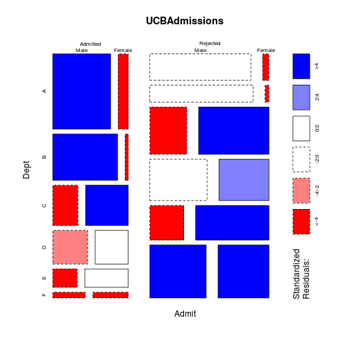

Log-linear models
=========================


Install required packages
-------------------------

[`MASS`](http://cran.r-project.org/package=MASS)


```r
wants <- c("MASS")
has   <- wants %in% rownames(installed.packages())
if(any(!has)) install.packages(wants[!has])
```

Log-linear model
-------------------------
    
### Data

`UCBAdmissions` is a built-in $(2 \times 2 \times 6)$ contingency table.


```r
library(MASS)
str(UCBAdmissions)
```

```
 table [1:2, 1:2, 1:6] 512 313 89 19 353 207 17 8 120 205 ...
 - attr(*, "dimnames")=List of 3
  ..$ Admit : chr [1:2] "Admitted" "Rejected"
  ..$ Gender: chr [1:2] "Male" "Female"
  ..$ Dept  : chr [1:6] "A" "B" "C" "D" ...
```

Test model of complete independence (= full additivity) based on data in a contingency table.


```r
(llFit <- loglm(~ Admit + Dept + Gender, data=UCBAdmissions))
```

```
Call:
loglm(formula = ~Admit + Dept + Gender, data = UCBAdmissions)

Statistics:
                      X^2 df P(> X^2)
Likelihood Ratio 2097.671 16        0
Pearson          2000.328 16        0
```

Test the same model based on data in a data frame with variable `Freq` as the observed category frequencies.


```r
UCBAdf <- as.data.frame(UCBAdmissions)
loglm(Freq ~ Admit + Dept + Gender, data=UCBAdf)
```

```
Call:
loglm(formula = Freq ~ Admit + Dept + Gender, data = UCBAdf)

Statistics:
                      X^2 df P(> X^2)
Likelihood Ratio 2097.671 16        0
Pearson          2000.328 16        0
```

Specific model of conditional independence.


```r
loglm(~ Admit + Dept + Gender + Admit:Dept + Dept:Gender, data=UCBAdmissions)
```

```
Call:
loglm(formula = ~Admit + Dept + Gender + Admit:Dept + Dept:Gender, 
    data = UCBAdmissions)

Statistics:
                      X^2 df    P(> X^2)
Likelihood Ratio 21.73551  6 0.001351993
Pearson          19.93841  6 0.002840164
```

### Mosaic-plot of category frequencies


```r
mosaicplot(~ Admit + Dept + Gender, shade=TRUE, data=UCBAdmissions)
```

 

### Coefficient estimates

`coef(loglm(...))` automatically uses effect coding.


```r
(llCoef <- coef(llFit))
```

```
$`(Intercept)`
[1] 5.177567

$Admit
  Admitted   Rejected 
-0.2283697  0.2283697 

$Gender
      Male     Female 
 0.1914342 -0.1914342 

$Dept
          A           B           C           D           E           F 
 0.23047857 -0.23631478  0.21427076  0.06663476 -0.23802565 -0.03704367 
```

```r
exp(llCoef$Gender)
```

```
    Male   Female 
1.210985 0.825774 
```

### Standard errors for parameter estimates

Get standard errors for parameter estimates from fitting the corresponding Poisson-regression with `glm()` - default with treatment coding.


```r
glmFitT <- glm(Freq ~ Admit + Dept + Gender, family=poisson(link="log"), data=UCBAdf)
coef(summary(glmFitT))
```

```
                 Estimate Std. Error     z value     Pr(>|z|)
(Intercept)    5.37110984 0.03963977 135.4980063 0.000000e+00
AdmitRejected  0.45673941 0.03050686  14.9716962 1.124171e-50
DeptB         -0.46679335 0.05273601  -8.8515102 8.634289e-19
DeptC         -0.01620781 0.04648785  -0.3486461 7.273550e-01
DeptD         -0.16384381 0.04831585  -3.3910984 6.961310e-04
DeptE         -0.46850422 0.05276479  -8.8791074 6.739899e-19
DeptF         -0.26752224 0.04972276  -5.3802772 7.437123e-08
GenderFemale  -0.38286839 0.03027464 -12.6465054 1.169626e-36
```

```r
# glm() fitted values are the same as loglm() ones
all.equal(c(fitted(llFit)), fitted(glmFitT), check.attributes=FALSE)
```

```
Re-fitting to get fitted values
```

```
[1] TRUE
```

### Convert parameter estimates from `glm()` and `loglm()`

With `glm()`, the default coding scheme for categorical variables is treatment coding where the first group in a factor is the reference level, and the respective parameter of each remaining group is its difference to this reference. The (Intercept) estimate is for the cell with all groups = reference level for their factor. `glm()` does not list those parameter estimates that are fully determined (aliased) through the sum-to-zero constraint for the parameters for one factor.

With `loglm()`, the parameters are for deviation coding, meaning that each group gets its own parameter, and the parameters for one factor sum to zero. (Intercept) is the grand mean that gets added to all group effects.

Effect coding coefficient estimates from `loglm()` can be converted to treatment coding estimates from `glm()`.


```r
(glmTcoef <- coef(glmFitT))
```

```
  (Intercept) AdmitRejected         DeptB         DeptC         DeptD 
   5.37110984    0.45673941   -0.46679335   -0.01620781   -0.16384381 
        DeptE         DeptF  GenderFemale 
  -0.46850422   -0.26752224   -0.38286839 
```

```r
glmTcoef["(Intercept)"]
```

```
(Intercept) 
    5.37111 
```

```r
llCoef$`(Intercept)` + llCoef$Admit["Admitted"] + llCoef$Gender["Male"]  + llCoef$Dept["A"]
```

```
Admitted 
 5.37111 
```

```r
glmTcoef["(Intercept)"] + glmTcoef["DeptC"] + glmTcoef["GenderFemale"]
```

```
(Intercept) 
   4.972034 
```

```r
llCoef$`(Intercept)` + llCoef$Admit["Admitted"] + llCoef$Dept["C"] + llCoef$Gender["Female"]
```

```
Admitted 
4.972034 
```

`glm()` can directly use effect coding to get the same paramter estimates as `loglm()`, but also standard errors.


```r
glmFitE <- glm(Freq ~ Admit + Dept + Gender, family=poisson(link="log"),
               contrasts=list(Admit=contr.sum,
                               Dept=contr.sum,
                             Gender=contr.sum), data=UCBAdf)
coef(summary(glmFitE))
```

```
               Estimate Std. Error    z value     Pr(>|z|)
(Intercept)  5.17756677 0.01577888 328.132716 0.000000e+00
Admit1      -0.22836970 0.01525343 -14.971696 1.124171e-50
Dept1        0.23047857 0.03071783   7.503086 6.233240e-14
Dept2       -0.23631478 0.03699431  -6.387869 1.682136e-10
Dept3        0.21427076 0.03090740   6.932668 4.129780e-12
Dept4        0.06663476 0.03272311   2.036321 4.171810e-02
Dept5       -0.23802565 0.03702165  -6.429363 1.281395e-10
Gender1      0.19143420 0.01513732  12.646505 1.169626e-36
```

Detach (automatically) loaded packages (if possible)
-------------------------


```r
try(detach(package:MASS))
```

Get the article source from GitHub
----------------------------------------------

[R markdown](https://github.com/dwoll/RExRepos/raw/master/Rmd/logLinear.Rmd) - [markdown](https://github.com/dwoll/RExRepos/raw/master/md/logLinear.md) - [R code](https://github.com/dwoll/RExRepos/raw/master/R/logLinear.R) - [all posts](https://github.com/dwoll/RExRepos/)
