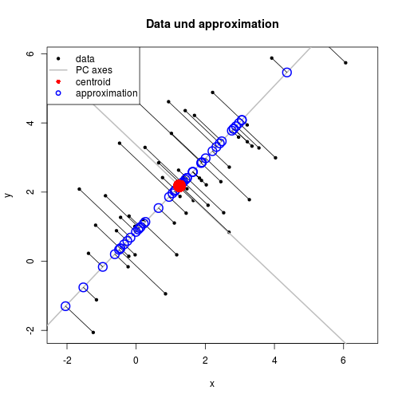

Principal components analysis
=========================

Install required packages
-------------------------

[`mvtnorm`](http://cran.r-project.org/package=mvtnorm), [`robustbase`](http://cran.r-project.org/package=robustbase), [`pcaPP`](http://cran.r-project.org/package=pcaPP)


```r
wants <- c("mvtnorm", "robustbase", "pcaPP")
has   <- wants %in% rownames(installed.packages())
if(any(!has)) install.packages(wants[!has])
```

PCA
-------------------------
    
### Using `prcomp()`


```r
set.seed(123)
library(mvtnorm)
Sigma <- matrix(c(4, 2, 2, 3), ncol=2)
mu    <- c(1, 2)
N     <- 50
X     <- rmvnorm(N, mean=mu, sigma=Sigma)
```


```r
(pca <- prcomp(X))
```

```
Standard deviations:
[1] 2.114979 1.099903

Rotation:
           PC1        PC2
[1,] 0.6877487 -0.7259489
[2,] 0.7259489  0.6877487
```


```r
summary(pca)
```

```
Importance of components:
                          PC1    PC2
Standard deviation     2.1150 1.0999
Proportion of Variance 0.7871 0.2129
Cumulative Proportion  0.7871 1.0000
```

```r
pca$sdev^2 / sum(diag(cov(X)))
```

```
[1] 0.787119 0.212881
```


```r
plot(pca)
```

 

For rotated principal components, see `principal()` from package [`psych`](http://cran.r-project.org/package=psych).

### Using `princomp()`


```r
(pcaPrin <- princomp(X))
```

```
Call:
princomp(x = X)

Standard deviations:
  Comp.1   Comp.2 
2.093723 1.088849 

 2  variables and  50 observations.
```

```r
(G <- pcaPrin$loadings)
```

```

Loadings:
     Comp.1 Comp.2
[1,]  0.688 -0.726
[2,]  0.726  0.688

               Comp.1 Comp.2
SS loadings       1.0    1.0
Proportion Var    0.5    0.5
Cumulative Var    0.5    1.0
```

### Find principal components

Principal component values for original data.


```r
pcVal <- predict(pca)
head(pcVal, n=5)
```

```
           PC1        PC2
[1,] -1.633097  0.4595479
[2,]  2.503028 -1.4578202
[3,]  2.624500  1.1630316
[4,] -1.498896 -1.3124061
[5,] -2.191086  0.4319243
```

Principal component values for new data.


```r
Xnew <- matrix(1:4, ncol=2)
predict(pca, newdata=Xnew)
```

```
           PC1       PC2
[1,] 0.4241819 0.7484588
[2,] 1.8378795 0.7102586
```

### Illustration


```r
B    <- G %*% diag(pca$sdev)
ctr  <- colMeans(X)
xMat <- rbind(ctr[1] - B[1, ], ctr[1])
yMat <- rbind(ctr[2] - B[2, ], ctr[2])
ab1  <- solve(cbind(1, xMat[ , 1]), yMat[ , 1])
ab2  <- solve(cbind(1, xMat[ , 2]), yMat[ , 2])
```


```r
plot(X, xlab="x", ylab="y", pch=20, asp=1,
     main="Data und principal components")
abline(coef=ab1, lwd=2, col="gray")
abline(coef=ab2, lwd=2, col="gray")
matlines(xMat, yMat, lty=1, lwd=6, col="blue")
points(ctr[1], ctr[2], pch=16, col="red", cex=3)
legend(x="topleft", legend=c("data", "PC axes", "SDs of PC", "centroid"),
       pch=c(20, NA, NA, 16), lty=c(NA, 1, 1, NA), lwd=c(NA, 2, 2, NA),
       col=c("black", "gray", "blue", "red"), bg="white")
```

 

### Approximate data by their principal components

#### Full reproduction using all principal components


```r
Xdot <- scale(X, center=TRUE, scale=FALSE)
Y    <- Xdot %*% G
B    <- G %*% diag(pca$sdev)
H    <- scale(Y)
HB   <- H %*% t(B)

repr <- sweep(HB, 2, ctr, "+")
all.equal(X, repr)
```

```
[1] TRUE
```

```r
sum((X-repr)^2)
```

```
[1] 1.365715e-29
```

#### Approximation using only the first principal component


```r
HB1   <- H[ , 1] %*% t(B[ , 1])
repr1 <- sweep(HB1, 2, ctr, "+")
sum((X-repr1)^2)
```

```
[1] 59.27955
```

```r
qr(scale(repr1, center=TRUE, scale=FALSE))$rank
```

```
[1] 1
```


```r
plot(X, xlab="x", ylab="y", pch=20, asp=1, main="Data und approximation")
abline(coef=ab1, lwd=2, col="gray")
abline(coef=ab2, lwd=2, col="gray")
segments(X[ , 1], X[ , 2], repr1[ , 1], repr1[ , 2])
points(repr1, pch=1, lwd=2, col="blue", cex=2)
points(ctr[1], ctr[2], pch=16, col="red", cex=3)
legend(x="topleft", legend=c("data", "PC axes", "centroid", "approximation"),
       pch=c(20, NA, 16, 1), lty=c(NA, 1, NA, NA), lwd=c(NA, 2, NA, 2),
       col=c("black", "gray", "red", "blue"), bg="white")
```

 

### Approximate the covariance matrix using principal components


```r
B %*% t(B)
```

```
         [,1]     [,2]
[1,] 2.753346 1.629294
[2,] 1.629294 2.929578
```

```r
cov(X)
```

```
         [,1]     [,2]
[1,] 2.753346 1.629294
[2,] 1.629294 2.929578
```

```r
B[ , 1] %*% t(B[ , 1])
```

```
         [,1]     [,2]
[1,] 2.115786 2.233305
[2,] 2.233305 2.357351
```

Robust PCA
-------------------------


```r
library(robustbase)
princomp(X, cov=covMcd(X))
```

```
Call:
princomp(x = X, covmat = covMcd(X))

Standard deviations:
  Comp.1   Comp.2 
2.466551 1.047429 

 2  variables and  50 observations.
```


```r
library(pcaPP)
PCAproj(X, k=ncol(X), method="qn")
```

```
Call:
PCAproj(x = X, k = ncol(X), method = "qn")

Standard deviations:
  Comp.1   Comp.2 
2.100548 1.170746 

 2  variables and  50 observations.
```

Detach (automatically) loaded packages (if possible)
-------------------------


```r
try(detach(package:pcaPP))
try(detach(package:mvtnorm))
try(detach(package:robustbase))
```

Get the article source from GitHub
----------------------------------------------

[R markdown](https://github.com/dwoll/RExRepos/raw/master/Rmd/multPCA.Rmd) - [markdown](https://github.com/dwoll/RExRepos/raw/master/md/multPCA.md) - [R code](https://github.com/dwoll/RExRepos/raw/master/R/multPCA.R) - [all posts](https://github.com/dwoll/RExRepos/)
